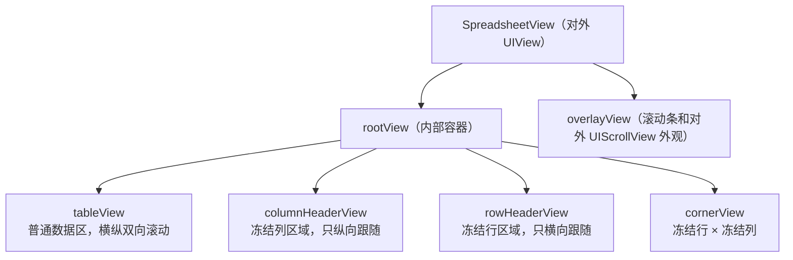
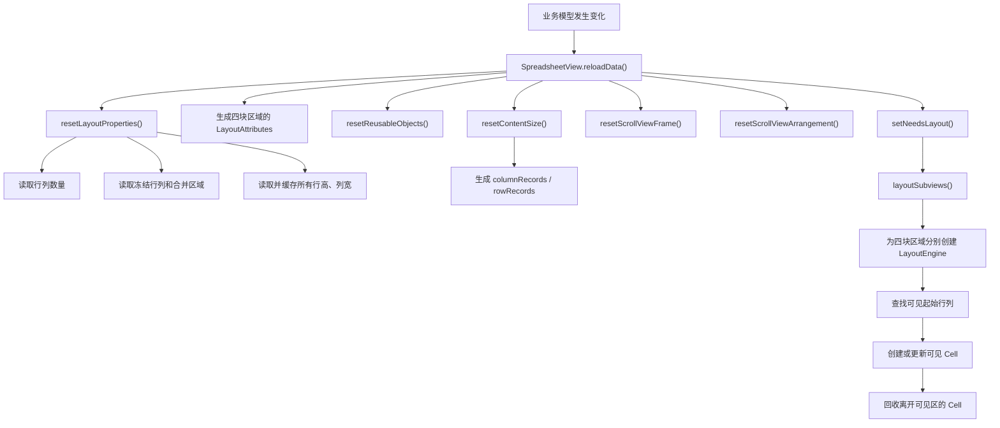
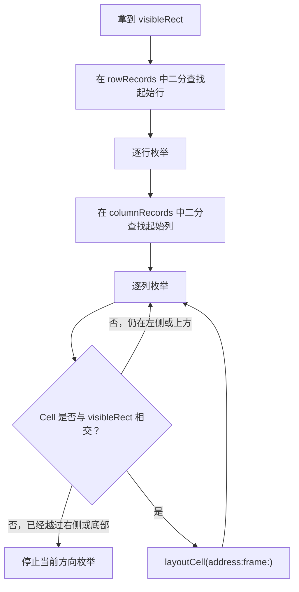
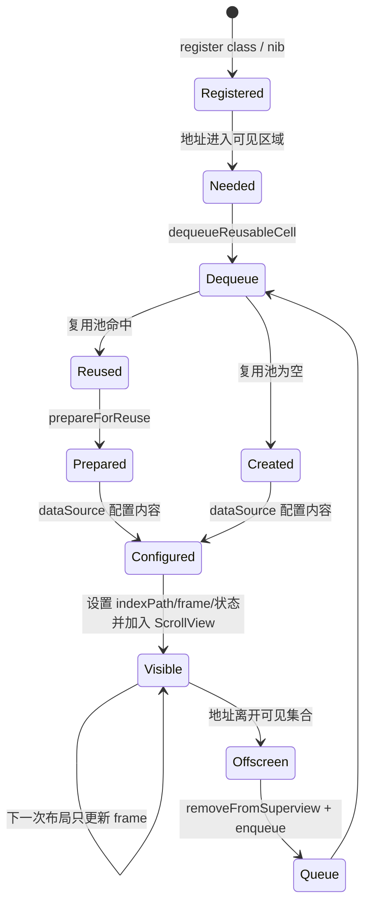
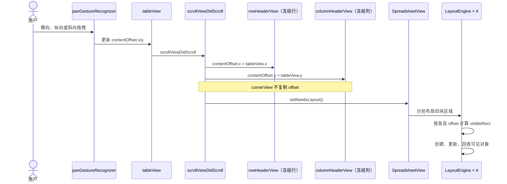

# SpreadsheetView 源码阅读手册

> 面向当前仓库中 vendored 的 `SpreadsheetView` 源码。本文以实际代码为准，帮助读者理解架构、刷新、布局、滚动、冻结行列、Cell 复用以及各文件职责。

## 0. 如何使用这份手册

推荐不要从文件列表逐个硬啃，而是按下面顺序阅读：

1. 先读“整体架构”，建立四块滚动区域的模型；
2. 再跟一次 `reloadData` 调用链；
3. 再跟一次用户拖拽引发的滚动调用链；
4. 最后单独研究 Cell 复用、合并单元格和循环滚动；
5. 打开 Demo，给关键方法加断点验证理解。

源码中还加入了两类可搜索注释：

- `LEARNING:`：架构、刷新、布局和复用的关键说明；
- `LEARNING-SCROLL 1/8` 到 `8/8`：滚动链的逐步阅读顺序。

本文使用三种结论标签：

- **【源码事实】**：可以直接由当前源码确认；
- **【源码推断】**：根据代码结构得出的解释，还需要运行验证边界；
- **【待实验】**：需要日志、断点、不同数据规模或设备环境才能确认。

---

## 1. 一句话理解这个库

**【源码事实】** `SpreadsheetView` 不是一个单独滚动的二维表格。它把表格拆成四个内部 `UIScrollView`，再同步它们的滚动位置：



对应源码：

- [`SpreadsheetView.swift`](../LearnSpreadSheetLib/ThirdParty/SpreadsheetView/Sources/SpreadsheetView.swift)：主类型和内部视图创建；
- [`SpreadsheetView+Layout.swift`](../LearnSpreadSheetLib/ThirdParty/SpreadsheetView/Sources/SpreadsheetView+Layout.swift)：四块区域的范围、frame 和布局；
- [`SpreadsheetView+UIScrollViewDelegate.swift`](../LearnSpreadSheetLib/ThirdParty/SpreadsheetView/Sources/SpreadsheetView+UIScrollViewDelegate.swift)：滚动同步。

### 1.1 最容易看反的命名

请优先记住行为，不要只按变量名猜：

| 内部对象 | 实际内容 | 跟随方向 |
| --- | --- | --- |
| `tableView` | 非冻结的普通单元格 | 横向 + 纵向 |
| `rowHeaderView` | 冻结行 | 只复制 `tableView.contentOffset.x` |
| `columnHeaderView` | 冻结列 | 只复制 `tableView.contentOffset.y` |
| `cornerView` | 冻结行与冻结列的交叉部分 | 正常情况下两个方向都不跟随 |

---

## 2. 对外接口层

### 2.1 `SpreadsheetViewDataSource`

数据源负责“表格是什么”：

- 行数、列数；
- 行高、列宽；
- 指定位置使用哪个 Cell；
- 冻结多少行、多少列；
- 哪些区域需要合并。

协议位于 [`SpreadsheetViewDataSource.swift`](../LearnSpreadSheetLib/ThirdParty/SpreadsheetView/Sources/SpreadsheetViewDataSource.swift)。

必须实现：

```swift
func numberOfColumns(in spreadsheetView: SpreadsheetView) -> Int
func numberOfRows(in spreadsheetView: SpreadsheetView) -> Int
func spreadsheetView(_ spreadsheetView: SpreadsheetView, widthForColumn column: Int) -> CGFloat
func spreadsheetView(_ spreadsheetView: SpreadsheetView, heightForRow row: Int) -> CGFloat
```

有默认实现、可按需覆盖：

```swift
func spreadsheetView(_ spreadsheetView: SpreadsheetView, cellForItemAt indexPath: IndexPath) -> Cell?
func mergedCells(in spreadsheetView: SpreadsheetView) -> [CellRange]
func frozenColumns(in spreadsheetView: SpreadsheetView) -> Int
func frozenRows(in spreadsheetView: SpreadsheetView) -> Int
```

### 2.2 `SpreadsheetViewDelegate`

代理负责“用户如何与表格交互”：

- 是否高亮；
- 高亮和取消高亮通知；
- 是否选中、取消选中；
- 选中状态变化通知。

它不参与尺寸计算、Cell 创建或滚动同步。源码位于 [`SpreadsheetViewDelegate.swift`](../LearnSpreadSheetLib/ThirdParty/SpreadsheetView/Sources/SpreadsheetViewDelegate.swift)。

### 2.3 自定义 Cell

自定义 Cell 应继承 [`Cell`](../LearnSpreadSheetLib/ThirdParty/SpreadsheetView/Sources/Cell.swift)：

```swift
final class MyCell: Cell {
    override func prepareForReuse() {
        super.prepareForReuse()
        // 清理属于旧 indexPath 的文本、图片、异步任务和临时状态
    }
}
```

业务子视图应放进 `contentView`。不要从业务 Cell 修改内部滚动区域的 frame、层级或 `contentOffset`。

---

## 3. `reloadData` 完整调用链

### 3.1 总览



### 3.2 第一步：汇总布局配置

入口是 `resetLayoutProperties()`：

1. 调数据源获取总行数、总列数；
2. 获取冻结行数、冻结列数；
3. 校验冻结数量不能超过总数量；
4. 校验合并区域是否合法；
5. 遍历所有列，生成 `columnWidthCache`；
6. 遍历所有行，生成 `rowHeightCache`；
7. 汇总冻结区域和普通区域总尺寸。

**【源码事实】** 行高和列宽是在 `reloadData` 阶段集中读取并缓存的。因此模型中尺寸发生变化后，只调用 `setNeedsLayout()` 不够，需要 `reloadData()`。

### 3.3 第二步：四区域分工

`SpreadsheetView+Layout.swift` 中的四个方法决定每块区域包含哪些行列：

```text
layoutAttributeForCornerView
layoutAttributeForColumnHeaderView
layoutAttributeForRowHeaderView
layoutAttributeForTableView
```

可以把它理解成对一张二维表的切片：

```text
                     列
          冻结列                普通列
      ┌──────────────┬────────────────────────┐
冻结行│  cornerView  │     rowHeaderView      │
      │              │      只横向滚动        │
行    ├──────────────┼────────────────────────┤
普通行│columnHeader  │       tableView        │
      │    View      │      横纵双向滚动       │
      │ 只纵向滚动   │                        │
      └──────────────┴────────────────────────┘
```

### 3.4 第三步：生成位置记录

`resetContentSize(of:)` 为每块区域建立：

- `columnRecords`：每一列相对内容区的 x 起点；
- `rowRecords`：每一行相对内容区的 y 起点。

例如列宽为 `[100, 80, 120]`，间距为 `1`，记录大致是：

```text
columnRecords = [0, 101, 182]
```

这些记录让布局引擎能通过二分查找直接定位当前 offset 附近的行列，而不必每次从第 0 个元素开始累加。

### 3.5 第四步：进入 UIKit 布局

`reloadData()` 最后调用 `setNeedsLayout()`。UIKit 随后执行 `layoutSubviews()`：

1. 暂时移除内部 ScrollView 的 delegate，避免布局写回状态时递归触发滚动回调；
2. 把真实 `frame/contentSize/contentOffset` 复制到 `state`；
3. 必要时处理循环滚动回中；
4. 依次布局 `cornerView`、`rowHeaderView`、`columnHeaderView`、`tableView`；
5. 在 `defer` 中把 state 写回真实 ScrollView，并恢复 delegate。

---

## 4. LayoutEngine 如何寻找可见 Cell

### 4.1 每个区域都有自己的引擎实例

`layout(scrollView:)` 每次都会创建一个 `LayoutEngine`。引擎只处理传入的那一个内部 ScrollView。

初始化时确定：

- 当前区域的 `frame`；
- 当前区域的 `contentOffset`；
- 当前区域负责的起始行列和行列总数；
- 全局行高、列宽缓存；
- 当前选中和高亮状态。

可见矩形为：

```swift
visibleRect = CGRect(
    origin: scrollView.state.contentOffset,
    size: scrollView.state.frame.size
)
```

### 4.2 查找算法



二分查找实现在 [`Array+BinarySearch.swift`](../LearnSpreadSheetLib/ThirdParty/SpreadsheetView/Sources/Array+BinarySearch.swift)，调用入口在 `LayoutEngine.layout()` 和 `enumerateColumns(...)`。

### 4.3 `Address` 与 `Location` 的区别

- `Location(row, column)`：逻辑数据坐标，主要用于合并单元格查询；
- `Address(row, column, rowIndex, columnIndex)`：布局地址；循环滚动时，同一个逻辑坐标可能在重复内容中出现多次，因此还需要实际布局索引。

普通模式下两者看起来接近；研究循环滚动时不能混为一谈。

---

## 5. Cell 创建、显示、复用和回收



### 5.1 注册与 dequeue

`SpreadsheetView` 分别保存：

- `cellClasses`；
- `cellNibs`；
- 按 reuse identifier 分类的 `cellReuseQueues`。

dequeue 顺序：

1. 尝试从对应 `ReuseQueue` 取 Cell；
2. 命中时调用 `prepareForReuse()`；
3. 未命中时，根据注册的 class 或 nib 创建；
4. 没有注册则 `fatalError`。

### 5.2 Cell 何时向数据源请求

`LayoutEngine.layoutCell` 先检查当前区域的 `visibleCells`：

- 已经存在：只更新 frame 和装饰；
- 不存在：调用 `dataSource.cellForItemAt`，设置 frame、indexPath、高亮和选中状态，然后插入内部 ScrollView。

### 5.3 回收

一次布局结束后，`returnReusableResouces()` 比较：

```text
上一次可见地址集合 - 本次可见地址集合
```

差集中的 Cell 会：

1. `removeFromSuperview()`；
2. 按 `reuseIdentifier` 放回复用池；
3. 从当前区域的可见映射移除。

### 5.4 `reloadData` 与普通滚动的区别

| 场景 | 行列尺寸是否重读 | 可见对象处理 |
| --- | --- | --- |
| 普通滚动 | 否 | 保留仍可见 Cell，只创建新进入和回收离开的 Cell |
| `reloadData()` | 是 | 四个区域先清空可见对象，再重新布局 |

---

## 6. 滚动事件完整逻辑

### 6.1 阅读入口

在源码搜索：

```text
LEARNING-SCROLL
```

即可按照 `1/8` 到 `8/8` 阅读。

### 6.2 用户拖拽调用链



### 6.3 四种滚动效果

正常范围内，核心同步只有：

```swift
rowHeaderView.contentOffset.x = tableView.contentOffset.x
columnHeaderView.contentOffset.y = tableView.contentOffset.y
```

由此得到：

| 用户看到的行为 | 实际变化 |
| --- | --- |
| 普通区域横向滚动 | `tableView.contentOffset.x` |
| 普通区域纵向滚动 | `tableView.contentOffset.y` |
| 冻结行内容横向滚动 | `rowHeaderView.contentOffset.x` 复制主表 x |
| 冻结列内容纵向滚动 | `columnHeaderView.contentOffset.y` 复制主表 y |
| 左上角保持固定 | `cornerView` 不复制正常滚动 offset |

### 6.4 为什么同步 offset 后还要重新布局

修改 offset 只改变“窗口看向内容的哪个位置”。库还需要：

1. 重新计算四块区域各自的可见矩形；
2. 找出新进入可见区的地址；
3. 向数据源请求对应 Cell；
4. 回收离开可见区的 Cell；
5. 更新网格线、边框和合并单元格。

因此 `scrollViewDidScroll` 最后调用 `setNeedsLayout()`。

### 6.5 Bounce 与 Sticky

当主表被拉过左边界或上边界时，offset 会暂时小于 0。库会根据：

- `stickyColumnHeader`；
- `stickyRowHeader`；

决定冻结区域是否也跟随拉伸。

这部分修改的是 `cornerView`、`columnHeaderView`、`rowHeaderView` 的 frame origin；它与正常范围内复制 `contentOffset` 是两套不同逻辑。

### 6.6 程序化滚动

对外的：

```swift
spreadsheetView.contentOffset = ...
spreadsheetView.setContentOffset(..., animated: true)
```

最终都作用于 `tableView`。动画过程同样会触发滚动代理，因此冻结区域继续同步。

`scrollToItem(at:at:animated:)` 会先利用 `columnRecords`、`rowRecords` 和目标 Cell 尺寸计算主表目标 offset，再调用 `tableView.setContentOffset`。

---

## 7. 固定首行、首列

业务侧只需要：

```swift
func frozenColumns(in spreadsheetView: SpreadsheetView) -> Int { 1 }
func frozenRows(in spreadsheetView: SpreadsheetView) -> Int { 1 }
```

**【源码事实】** 冻结不是给 Cell 设置特殊 frame，而是让四个内部 ScrollView 分别管理不同数据范围。

### 7.1 Frame 划分

`resetScrollViewFrame()` 会：

- 用冻结列宽确定 `tableView.frame.origin.x`；
- 用冻结行高确定 `tableView.frame.origin.y`；
- 缩小普通表格区域的可视宽高；
- 计算冻结行、冻结列和角落区域的 frame。

### 7.2 层级

`resetScrollViewArrangement()` 重新按指定顺序添加四块区域。冻结 Cell 覆盖异常应按以下顺序排查：

1. 该 Cell 被分配到了哪个内部 ScrollView；
2. 该 ScrollView 的 frame；
3. 四个 ScrollView 的添加顺序；
4. Cell 自己的 frame；
5. 最后才考虑业务 Cell 的 `zPosition`。

---

## 8. 合并单元格

数据源通过 `mergedCells(in:)` 返回 `[CellRange]`。

`resetLayoutProperties()` 会把一个范围覆盖到的每个 `Location` 都映射回同一个 `CellRange`，方便布局时从任意成员位置找到合并范围。

### 8.1 约束

源码会直接拒绝：

- 超出总行列数量的范围；
- 两个范围发生不合法重叠；
- 一个合并范围跨越冻结与非冻结边界。

跨冻结边界被禁止，是因为同一个合并 Cell 无法同时属于两个不同的内部 ScrollView。

### 8.2 布局

`LayoutEngine` 遇到合并区域时：

1. 累加范围内列宽、行高和间距；
2. 把最终尺寸缓存到 `CellRange.size`；
3. 使用合并区域左上角作为逻辑地址；
4. 延迟到 `renderMergedCells()` 统一创建 Cell。

---

## 9. 网格线与边框

这两套概念分开处理：

- `Gridlines/GridStyle`：表格网格，底层用 `CALayer`；
- `Borders/BorderStyle`：Cell 边框，底层用 `UIView`。

`LayoutEngine` 在布局 Cell 时收集装饰信息，随后分别：

```text
renderVerticalGridlines()
renderHorizontalGridlines()
renderBorders()
```

网格线和边框也拥有自己的复用池，离开可见区时会被回收。

---

## 10. 触摸、高亮和选择

触摸流程位于 [`SpreadsheetView+Touches.swift`](../LearnSpreadSheetLib/ThirdParty/SpreadsheetView/Sources/SpreadsheetView+Touches.swift)：

```text
touchesBegan
-> 找到触摸下的 Cell
-> 询问 delegate 是否允许高亮
-> 更新同一 indexPath 对应的 Cell

touchesEnded
-> 根据单选/多选规则更新 selectedIndexPaths
-> 通知 delegate

touchesCancelled
-> 取消临时高亮
```

为什么“同一 indexPath 对应的 Cell”可能不止一个？循环滚动模式会重复显示同一逻辑坐标，因此选择状态需要同步到所有对应实例。

---

## 11. 循环滚动

循环滚动由两部分组成：

- [`CircularScrolling.swift`](../LearnSpreadSheetLib/ThirdParty/SpreadsheetView/Sources/CircularScrolling.swift)：公开配置和类型安全的 builder；
- [`SpreadsheetView+CirclularScrolling.swift`](../LearnSpreadSheetLib/ThirdParty/SpreadsheetView/Sources/SpreadsheetView+CirclularScrolling.swift)：缩放重复次数、中心 offset 和回中逻辑。

基本思想：

1. 把逻辑行列重复多份，扩大内容尺寸；
2. 初始滚动到中间副本；
3. 用户接近边缘时，把 offset 无感地搬回中心附近；
4. `Address` 使用实际布局索引区分多个副本，同时保留逻辑 row/column。

**【待实验】** 循环滚动与合并单元格、不同 header style、极端尺寸组合的边界行为，应分别建立 Demo 验证。

---

## 12. 动态数据刷新

当前源码没有 `reloadRows`、`reloadItems`、`insertRows` 等局部更新 API。

标准流程是：

```text
更新业务模型
-> spreadsheetView.reloadData()
-> 重读数量、尺寸、冻结和合并配置
-> 清空当前可见对象
-> 重建位置记录和四区域布局
```

**【源码推断】** 高频、小范围更新时，全量刷新可能产生不必要工作；是否成为真实性能问题取决于行列数量、可见 Cell 复杂度和刷新频率，应使用 Instruments 和日志测量。

---

## 13. 文件职责索引

### 核心入口与协议

| 文件 | 作用 |
| --- | --- |
| `SpreadsheetView.swift` | 主入口、公开属性、内部视图创建、注册与 dequeue、reload、滚动到指定 Cell、选择 API |
| `SpreadsheetViewDataSource.swift` | 行列数量、尺寸、Cell、合并、冻结配置协议 |
| `SpreadsheetViewDelegate.swift` | 高亮和选择代理协议 |
| `SpreadsheetView.h` | Framework 的 Objective-C umbrella header |

### 布局与滚动

| 文件 | 作用 |
| --- | --- |
| `SpreadsheetView+Layout.swift` | `layoutSubviews`、四区域范围、尺寸缓存、content size、frame 和层级 |
| `LayoutEngine.swift` | 可见区域查找、Cell 布局、合并单元格、网格线、边框和回收 |
| `ScrollView.swift` | 内部 UIScrollView 子类，保存位置记录、可见对象集合和布局 state |
| `SpreadsheetView+UIScrollView.swift` | 对外包装 `contentOffset/contentSize/contentInset` 等 UIScrollView 风格 API |
| `SpreadsheetView+UIScrollViewDelegate.swift` | 主表与冻结区域的 offset 同步、bounce/sticky 行为 |
| `SpreadsheetView+CirclularScrolling.swift` | 循环滚动居中、回中和重复倍数计算 |
| `CircularScrolling.swift` | 循环滚动公开配置模型 |
| `ScrollPosition.swift` | 滚动到 Cell 时的上、下、左、右、居中选项 |

### Cell 与复用

| 文件 | 作用 |
| --- | --- |
| `Cell.swift` | Cell 基类、contentView、选中背景、网格和边框配置、`prepareForReuse` |
| `ReuseQueue.swift` | 通用复用池与地址到可见对象的映射集合 |
| `Address.swift` | 同时包含逻辑坐标和实际布局索引的内部地址 |
| `Location.swift` | 公开的逻辑行列坐标 |
| `IndexPath+Column.swift` | 给 IndexPath 增加 `column` 语义 |

### 合并与装饰

| 文件 | 作用 |
| --- | --- |
| `CellRange.swift` | 合并单元格范围、包含判断和尺寸缓存 |
| `Gridlines.swift` | 网格线配置和内部 `Gridline` layer |
| `Borders.swift` | 边框配置和内部 `Border` view |

### 交互与 UIKit 适配

| 文件 | 作用 |
| --- | --- |
| `SpreadsheetView+Touches.swift` | 触摸、高亮、选中和取消选中流程 |
| `SpreadsheetView+UIViewHierarchy.swift` | 把外部 add/insert/bring/send 等操作转发到 overlayView |
| `SpreadsheetView+UISnapshotting.swift` | 快照时把四块内部区域组合到结果中 |
| `Array+BinarySearch.swift` | 在行列起点记录中二分查找可见起点 |

---

## 14. 哪些地方适合扩展

推荐扩展：

- 创建 `Cell` 子类；
- 在数据源中控制行列、尺寸、冻结和合并；
- 自定义 Cell 的背景、网格线和边框；
- 使用代理处理选择；
- 在业务模型层维护数据，然后调用 `reloadData()`。

谨慎或避免直接修改：

- `LayoutEngine` 的可见区域判断；
- 四个内部 ScrollView 的 frame 和层级；
- `scrollViewDidScroll` 的 offset 同步；
- `ReuseQueue` 和 `ReusableCollection`；
- 循环滚动的中心换算。

如果确实需要改这些位置，应先建立覆盖普通滚动、冻结行列、合并单元格和循环滚动的最小实验。

---

## 15. 常见问题排查清单

### Cell 显示了旧内容

1. `cellForItemAt` 是否覆盖了所有可变状态；
2. `prepareForReuse` 是否清理文本、图片、异步请求；
3. 异步回调是否确认 Cell 仍代表原 indexPath。

### 数据变化但界面没更新

1. 模型是否真的更新；
2. 是否在主线程调用 `reloadData()`；
3. 行列数和尺寸方法是否返回新值；
4. 是否误以为 `setNeedsLayout()` 会重读数据源尺寸。

### 冻结 Cell 覆盖普通 Cell

1. 检查冻结行列数量；
2. 检查 Cell 属于哪一个内部 ScrollView；
3. 打印四块区域的 frame；
4. 打印 subview hierarchy；
5. 检查 `resetScrollViewArrangement()`；
6. 检查是否有合并范围跨冻结边界。

### 表头与内容滚动错位

1. 打印 `tableView.contentOffset`；
2. 打印 `rowHeaderView.contentOffset.x`；
3. 打印 `columnHeaderView.contentOffset.y`；
4. 检查行高、列宽是否在刷新前后发生变化；
5. 检查 `intercellSpacing`；
6. 检查是否启用了循环滚动或 sticky header。

### Cell 没有出现

1. `numberOfRows/Columns` 是否大于 0；
2. 行高、列宽是否为正数；
3. Cell class/nib 是否注册；
4. `cellForItemAt` 是否使用 dequeue；
5. Cell 是否落在某块区域的 visibleRect 内。

---

## 16. 推荐断点与小实验

### 实验一：验证刷新调用链

断点顺序：

```text
ViewController.refreshData
SpreadsheetView.reloadData
resetLayoutProperties
layoutSubviews
LayoutEngine.layout
LayoutEngine.layoutCell
```

观察：按钮点击后，尺寸方法被重新调用，而普通滚动时不会重新调用尺寸方法。

### 实验二：验证四区域滚动

在 `scrollViewDidScroll` 中观察：

```swift
tableView.contentOffset
rowHeaderView.contentOffset
columnHeaderView.contentOffset
cornerView.contentOffset
```

分别只做横向、纵向和斜向拖动，确认各轴同步关系。

### 实验三：验证 Cell 复用

给以下位置加断点或临时日志：

```text
dataSource.cellForItemAt
dequeueReusableCell
Cell.prepareForReuse
returnReusableResouces
```

把 Demo 行列数临时扩大，使 Cell 能真正离开可见区域。

### 实验四：验证视图层级

在滚动后打印：

```swift
print(spreadsheetView.perform(Selector(("recursiveDescription"))) ?? "")
```

仅用于本地调试；验证结束后删除私有调试调用。

---

## 17. 当前 Demo

Demo 位于 [`ViewController.swift`](../LearnSpreadSheetLib/ViewController.swift)，包含：

- 3 行 3 列；
- 自定义 `DemoTextCell`；
- 固定首行、首列；
- 横向与纵向滚动；
- 修改模型并调用 `reloadData()`；
- Cell 复用清理示例。

建议下一步把数据扩为 20 × 20，并增加一个仅用于 Debug 的状态面板，实时显示四个内部区域的 `frame/contentSize/contentOffset/visibleCells.count`。这样能把本文中的静态模型变成可观察、可验证的运行模型。

---

## 18. 最终心智模型

当表格出现问题时，可以用下面这条链定位：

```text
数据源返回了什么？
-> reloadData 是否重建了尺寸和区域配置？
-> 当前坐标属于四块区域中的哪一块？
-> 该区域的 frame/contentOffset 是什么？
-> LayoutEngine 算出的 visibleRect 是什么？
-> Cell 是新建、复用、仍可见，还是刚被回收？
-> 最终 subview 层级和 frame 是否符合预期？
```

这比从截图直接猜 UIKit 行为可靠得多，也是继续阅读和修改这个库时最值得保留的排查路径。
